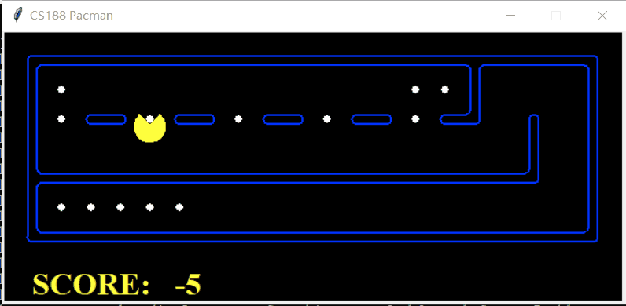

# UCB-CS188-2018FA

[Course Project Link](https://inst.eecs.berkeley.edu/~cs188/fa18/projects.html)

Environment: Python 3.6.6 (using Anaconda)

### Useful Knowledge:

#### Proj1 Search

* *DFS, BFS, UCS​* (Uniform Cost Search)
* *A\*​* Search

In *A\**​$ search, the essential problem is to find an appropriate heuristic function *h*​. It should satisfy the following conditions:

* admissible: *0 <= h(n) <= h\*(n)​*, where *h\*(n)* is the true cost to a nearest goal
* consistency: *f* ​ never decreases, where *f(n)=g(n)+h(n)*

*DFS,BFS,UCS,A\*​* essentially use the same idea. The differences between them are the strategies applied to selecting next node to expand.

Below shows the *A\** food search

 

#### Proj2 Multiagent

* Minimax, Alpha-Beta Pruning, Expectimax

Minimax is mainly used in the field of game tree. It deals with the zero-sum game, where each play takes turns to make a move. 

Alpha-Beta Pruning is based on Minimax. It is aimed at reducing search space. A nice explanation see: [youtube link](https://www.youtube.com/watch?v=xBXHtz4Gbdo). There is also a nice [demo](https://inst.eecs.berkeley.edu/~cs61b/fa14/ta-materials/apps/ab_tree_practice/) from UCB. 

Expectimax takes advantage of probability theory. It is also an extension to Minimax, replacing `min` layer with the expectation of the nodes' values underneath. In project it mitigates the problem of agent pacing back and forth without making any progress.

Below is a running of Expectimax with `betterEvaluationFunction`

